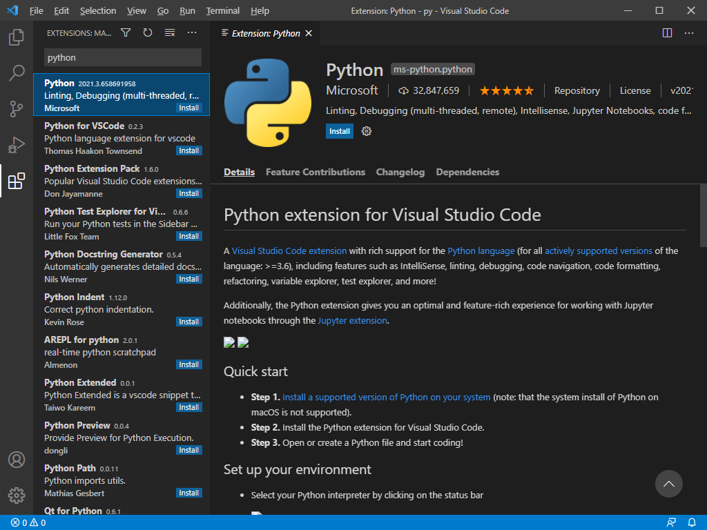
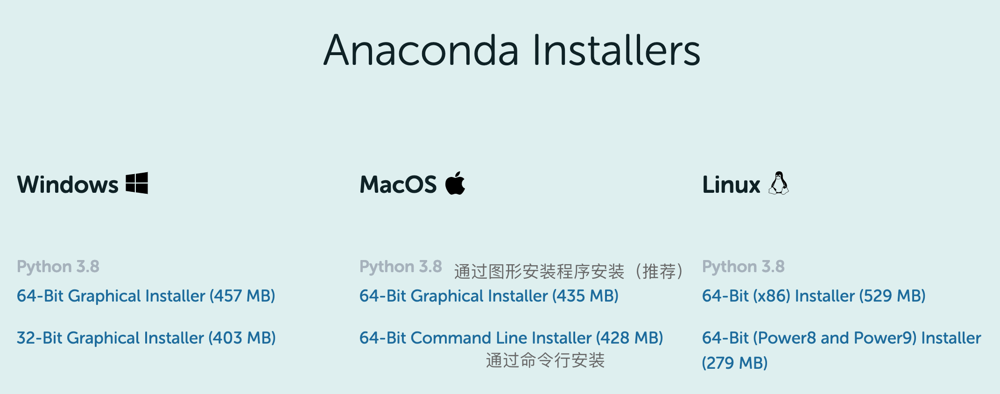
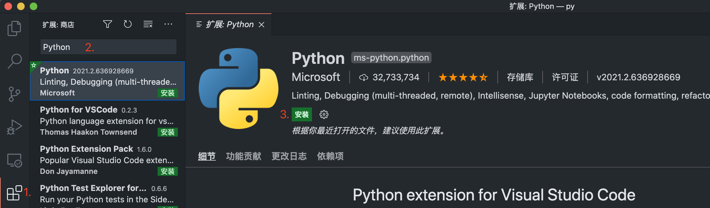
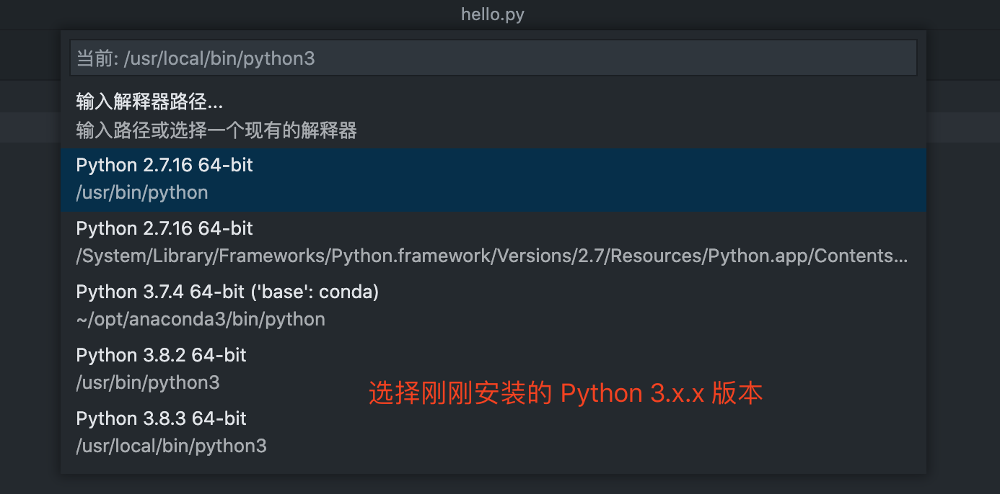

# Python 开发环境搭建

## Windows 用户请看这

### Python 安装 (Windows)

首先我们需要安装 Python，访问 [Python 官网](https://www.python.org/downloads/windows/)，选择 Stable Releases 下 Python 3.8.8 中的 Windows installer 下载，32 位还是 64 位根据个人情况选择哦。下载完毕后直接双击安装就好了，界面如下：


**记得勾选最下方的选项 `Add Python 3.8 to PATH`，可以省很多事儿。** 然后一路 next 点点点，Python 就安装好了。

<br>
### 代码编辑神器 VS Code
接下来我们讲介绍本次课程推荐使用的代码编辑器 — VS Code。VS Code 是一个轻量的免费跨平台代码编辑器。如果你还未安装 VS Code，可通过[其官网](https://code.visualstudio.com/)，直接下载安装。

安装 VS Code 的过程也是一路点点点，记得也要勾选 `添加到PATH` 这一项。


然后打开 VS Code，我们点击最左侧选项栏的扩展页，在搜索栏中搜索 Python，第一个就是我们所需要的插件，点击 `install` 即可安装～



现在，我们新建一个文件夹，并在 VS Code 中打开它，现在，我们通过 `ctrl` + `N` 来新建一个文件，并按下 `ctrl` + `S` 为 `hello.py`，现在 VS Code 识别到了我们正在编辑一个 Python 文件，窗口的左下角会出现我们所使用的 Python 解释器版本号。


现在，我们尝试在 `hello.py` 文件中输入：

```python
print("Hello, World!")
```

然后点一下右上角的绿色三角运行按钮。


你应该可以看到终端中输出的 `Hello World!`，现在， 我们的环境配置就算告一断落啦。


<br>
## mac OS 用户请看这

### Python 安装 (Windows)
本文主要介绍三种安装 Python 的方法：

1. 访问 [Python 官网](https://www.python.org/downloads/mac-osx/)，选择 Stable Releases 下的 Python 3.8.x installer 下载安装。

2. 通过 `Homebrew` 安装：

   > 如果你的电脑上已经安装了 `Homebrew`，则推荐使用此方式安装 ；或者虽然还未安装 `Homebrew`，但你是一名计算机系的学生，我们建议你了解一下 [`Homebrew`](https://brew.sh/) 并使用此方式安装 Python。

   在终端下输入以下命令：

   ```
   brew install python3
   ```

   由于网络环境因素，安装时间可能过长，可以考虑通过为 `Homebrew` 换源或者挂梯子等方式加速。  

   安装完成后，终端应显示如下内容（具体版本号可能有轻微不同，并不影响后续课程）。  

```
   Python has been installed as
     /usr/local/opt/python@3.8/bin/python3
   
   You can install Python packages with
     /usr/local/opt/python@3.8/bin/pip3 install <package>
   They will install into the site-package directory
     /usr/local/opt/python@3.8/Frameworks/Python.framework/Versions/3.8/lib/python3.8/site-packages
   
   See: https://docs.brew.sh/Homebrew-and-Python
   ==> Summary
   🍺  /usr/local/Cellar/python@3.8/3.8.3_1: 4,125 files, 63MB
```

   现在试试在终端中输入：

   ```
   python3 --version
   ```

   你应该可以看到（具体版本号可能有轻微不同，并不影响后续课程）：

   ```
   Python 3.8.3
   ```

3. 通过安装 Anaconda 来安装 Python。

   > 对于本课程来说，Anaconda 有些稍显臃肿，我们因此不推荐使用此方法安装 Python。如果你对数据科学非常感兴趣，计算机背景知识良好，也可以选择使用此方式安装 Python。

   进入 [Anaconda 官网下载页面](https://www.anaconda.com/products/individual#macos)，选择一个 Installer 下载（为了方便，我们推荐选择第一个 Graphical Installer）。

   

   如果下载速度不理想，可以通过 [清华源](https://mirrors.tuna.tsinghua.edu.cn/anaconda/archive/) 下载。点进页面后，拉到最下方，选择 `Anaconda3-5.3.1-MacOSX-x86_64.pkg` 这个包，下载即可。此处还有 TUNA 提供的 [Anaconda 镜像使用帮助](https://mirrors.tuna.tsinghua.edu.cn/help/anaconda/)。

   安装过程中，可以自行选择是否要一起打包安装 PyCharm，本课程中主要使用的编辑器为 Sublime Text 与 VS Code。

   现在试试在终端中输入：

   ```
   conda --version
   ```

   你应该可以看到（具体版本号可能有轻微不同，并不影响后续课程）：

   ```
   conda 4.7.12
   ```

接下来我们讲介绍本次课程推荐使用的代码编辑器 — VS Code。

<br>
### 代码编辑神器 VS Code
VS Code 是一个轻量的免费跨平台代码编辑器。如果你还未安装 VS Code，可通过 [其官网](https://code.visualstudio.com/)，直接下载安装。  

1. 安装完毕后，选择最左侧一栏中的扩展图标（1.）进入扩展商店，在搜索栏（2.）中输入 Python，点击安装（3.）来安装 VS Code 为 Python 提供的插件。


2. 安装插件完毕后，我们先创建一个文件夹，并且通过 VS Code 打开这个文件夹。之后按下 `Command` + `N`，创建一个新文件，并且按下`Command` + `S`，把它保存为`hello.py`。

   现在，VS Code 窗口的左下角，会出现你目前使用的 Python 环境，因为 mac OS 中自带了 Python 2.7，我们需要把它手动切换成我们刚刚安装的 Python 3。

   

   我们点击它，则可以选择其他 Python 解释器，因为笔者的 Mac 中有多个 Python 环境，所以这里的选项多一点，选择你刚刚安装的那个版本就好。

   

3. 现在，我们尝试在 `hello.py` 文件中输入：

   ```python
   print("Hello, World!")
   ```

   然后点一下右上角的绿色三角运行按钮。

   

   你应该可以看到编辑器下部分的终端中，成功打印了：

   ```
   ▶ python3 /Users/xiuxiu/Desktop/py/hello.py
   Hello, World!
   (base) 
   ```

至此，一个基本的 Python 开发环境已经配置好啦，我们在课程中也会慢慢介绍可能使用到的其他扩展～
